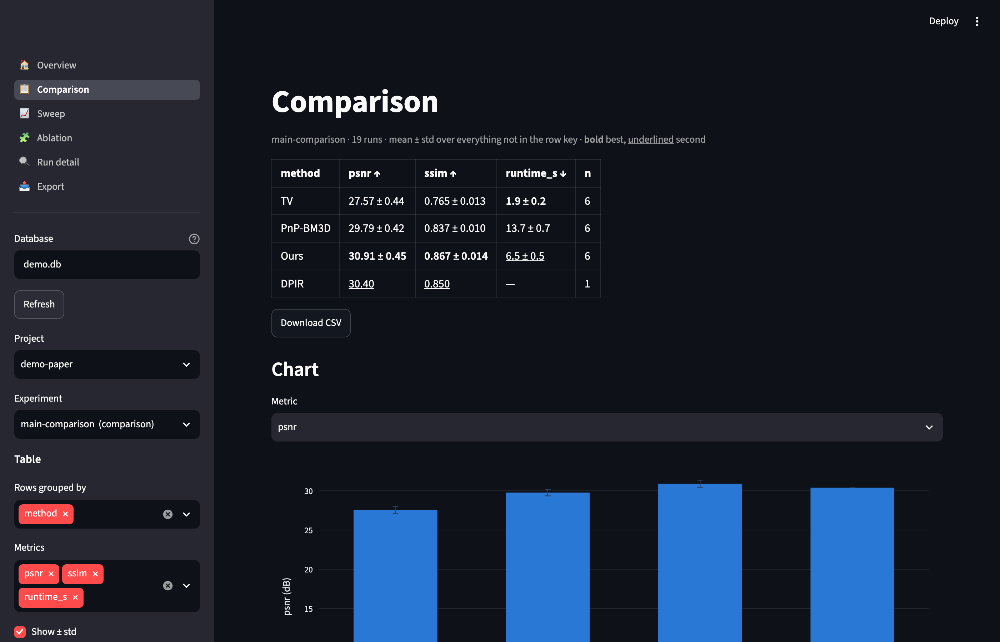
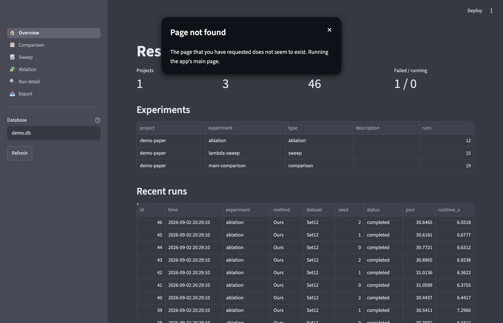
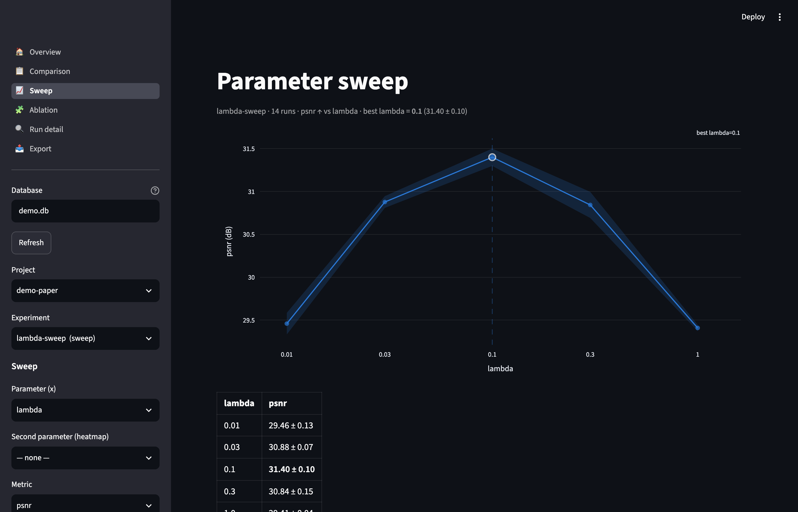
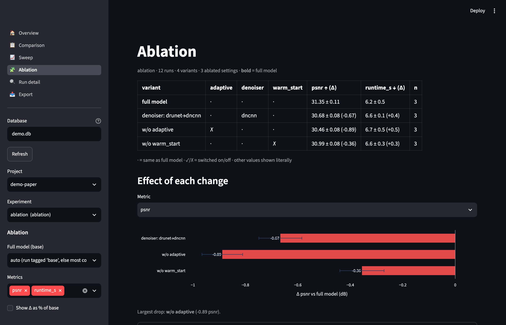
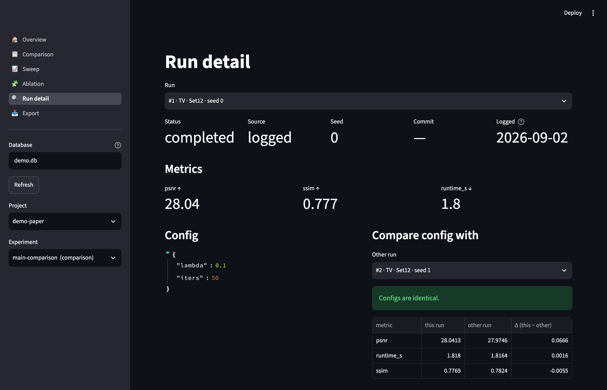
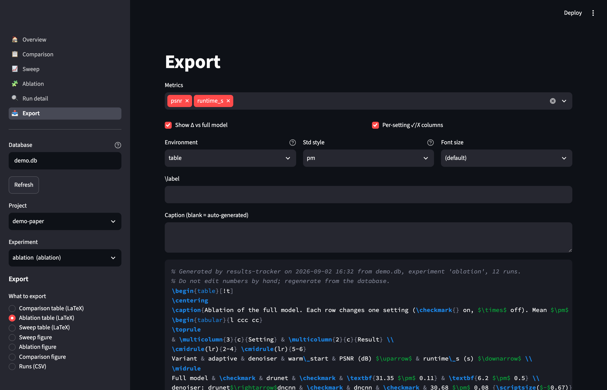

# results-tracker

Track paper results — method comparisons, parameter sweeps, ablation studies —
and export them as paper-ready tables and figures. Every number in the paper
traces back to a logged run; the table in the PDF is generated, not typed.



**Status:** v1.0 — all five planned phases are done: schema and logging API,
bulk import, six GUI pages (Overview, Comparison, Sweep, Ablation, Run detail,
Export), and paper exports (booktabs LaTeX tables, IEEE-sized vector figures).
See [PLAN.md](PLAN.md) for the design and [docs/PITCH.md](docs/PITCH.md) for the
5-minute demo script.

## 5-minute tour

```bash
python3 -m venv .venv && source .venv/bin/activate
pip install -e ".[dev,ui]"
results-tracker demo --db demo.db --artifacts demo_artifacts   # synthetic paper
results-tracker ui --db demo.db                                 # opens the GUI
```

The demo paper has three methods × two datasets × three seeds, a baseline copied
from another paper that only covers one dataset, a λ sweep with one diverged run,
and a one-at-a-time ablation. That is enough to show every page doing something
non-trivial:

| Page | What you see |
|---|---|
|  | **Overview** — projects, experiments, recent runs, failed-run count. |
|  | **Sweep** — PSNR vs λ on a log axis, ± std band, best value ringed. The diverged run shows up as n = 2, not as a silently smoother curve. |
|  | **Ablation** — settings matrix computed from config diffs, deltas vs the full model, blue helps / red hurts. |
|  | **Run detail** — config, metrics, config diff against any run, reconstruction and error map from disk. |
|  | **Export** — booktabs LaTeX with a provenance comment, ready to paste; the comparison export first audits the grid (7/8 cells present, 1 missing); figures download as vector PDF. |

Screenshots are regenerated with `python scripts/screenshot.py` (needs Chrome).

## Install

```bash
python3 -m venv .venv && source .venv/bin/activate
pip install -e ".[dev,ui]"
```

## Command line

```bash
results-tracker experiments --db demo.db
results-tracker table  -e main-comparison --by method --by dataset --db demo.db
results-tracker sweep  -e lambda-sweep --param lambda --metric psnr --db demo.db
results-tracker ablation -e ablation --db demo.db
results-tracker runs -e lambda-sweep --db demo.db
results-tracker demo --reset --db demo.db     # start the demo over
```

Set `RESULTS_TRACKER_DB=/path/to/results.db` to avoid passing `--db` every time.

## GUI

```bash
results-tracker ui --db results.db        # opens http://localhost:8501
```

Pages:

- **Overview** — what is in the database.
- **Comparison** — methods × metrics, mean ± std, best in bold, second
  underlined, bar chart, CSV download. Rows can be grouped by method, dataset,
  instance, seed, or any config key.
- **Sweep** — metric vs one swept config key (lines with ± std band, best value
  marked, log axis when the values span a decade) or vs two keys (heatmap).
  One line per method or dataset if you ask for it.
- **Ablation** — every config variant vs the full model: which settings changed
  (✓ / ✗ / value), mean ± std with Δ (absolute or %), and a bar chart of the
  deltas. The base is the run tagged `base`, else the most common config, or
  any run you pick.
- **Run detail** — config, metrics, config and metric diff against any other
  run, image gallery and log tail from the run's `artifacts_dir`.
- **Export** — LaTeX tables (comparison, ablation, sweep) and IEEE figures
  (sweep lines, ablation deltas, grouped comparison bars) with preview and
  download. The comparison export audits the grid first and lists missing or
  failed method × dataset cells.

## Paper exports

```bash
# booktabs table: methods as rows, dataset groups x metrics as columns
results-tracker export table -e main-comparison --label tab:main -o paper/tab_main.tex
results-tracker export table -e main-comparison --cols none --env none      # bare tabular to stdout
results-tracker export ablation-table -e ablation -o paper/tab_ablation.tex
results-tracker export sweep-table -e lambda-sweep --param lambda --metric psnr --param-label '$\lambda$'

# vector figures at IEEE column width (3.5 in single, 7.16 in double)
results-tracker export sweep-fig -e lambda-sweep --param lambda --metric psnr \
    --xlabel '$\lambda$' --ylabel 'PSNR (dB)' -o paper/fig_lambda.pdf --png
results-tracker export ablation-fig -e ablation --metric psnr -o paper/fig_ablation.pdf
results-tracker export comparison-fig -e main-comparison --metric psnr --emphasize Ours --width double -o paper/fig_main.pdf

results-tracker export runs-csv -e main-comparison -o all_runs.csv
```

Conventions baked in: rankings are computed on unrounded means, best is bold and
second best underlined per column, units and direction arrows sit in the header,
missing cells render as `--` and are listed in a comment, and every `.tex` starts
with a provenance comment (database, experiment, run count, timestamp). Method
row labels come from `define_method(name, label="TV~\cite{rudin}")`. Figures use
serif 8 pt text with embedded fonts, a fixed colour + line style + marker per
method, and hatching on bars so they survive grayscale printing.

## Importing existing results

```bash
# CSV: one row per run. Numeric columns become metrics unless listed as config.
results-tracker import old_results.csv -e main-comparison -p my-paper \
    --config-col lambda --config-col iters

# Directory of JSON run files ({"method":..., "config": {...}, "metrics": {...}})
results-tracker import runs/ -e lambda-sweep --type sweep

# Numbers copied from another paper
results-tracker import baselines.csv -e main-comparison --source reported

results-tracker import old_results.csv -e main-comparison --dry-run   # show the mapping first
```

Re-importing the same file is safe: identical runs are skipped.

## Logging from your own code

```python
from results_tracker import log_run

log_run(
    "lambda-sweep",                 # experiment name (created on first use)
    project="adaptive-pnp",         # one per paper
    method="ours", dataset="Set12", seed=0,
    config={"lambda": 0.1, "denoiser": "drunet", "adaptive": True},
    metrics={"psnr": 31.2, "ssim": 0.91, "runtime_s": 6.4},
    experiment_type="sweep",        # comparison | sweep | ablation (first call only)
    artifacts_dir="runs/2026-09-02/lambda0.1",  # images/logs live on disk, not in the DB
)
```

Git commit and hostname are captured automatically. Numpy/torch scalars are
converted; NaN becomes null. Metric direction (higher/lower is better) is
guessed from the name and can be overridden:

```bash
results-tracker metric define nrmse --lower --fmt .4f
```

## Data model

Everything is a **Run** (config JSON + metrics JSON) inside an **Experiment**
inside a **Project**. Comparisons group runs by method; sweeps group by a
config key; ablations group by the config diff against a base run (tag one
run `base`, or the most common config is used).

## Tests

```bash
pytest
```
